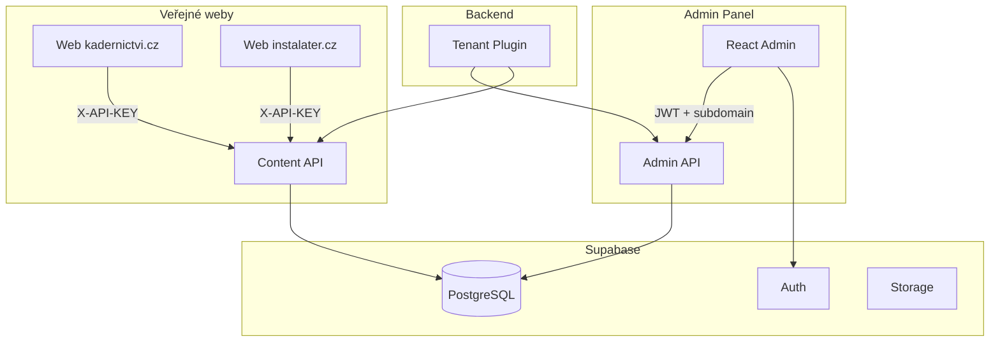

# Plán: Dokumentace Blueprint pro Multi-tenant Headless CMS

## Cíl

Vytvořit dokumentaci `docs/BLUEPRINT.md`, která slouží jako **opakovatelný návod** pro stavbu podobného CMS. Má obsahovat architekturu, rozhodnutí, vzory a checklist – ne jen popis aktuálního projektu.

---

## Struktura dokumentace

### 1. Úvod a rozsah

- Co blueprint pokrývá (multi-tenancy, block editor, headless API)
- Předpoklady (Node.js, Supabase, znalost React)
- Odhad složitosti (1–2 týdny pro základní verzi)

### 2. Architektura – diagramy

**2.1 Přehled systému (Mermaid)**

**2.2 Multi-tenancy model**

- Dva kanály: Admin (subdoména + JWT) vs Content (X-API-KEY)
- Tabulka `tenants` jako centrum
- Izolace dat přes `tenant_id` a RLS

**2.3 Datový tok**

- Admin: Host → tenant → JWT → CRUD
- Content: X-API-KEY → tenant → cache/DB → JSON

### 3. Databázové schéma

**3.1 Klíčové tabulky**

| Tabulka           | Účel                                      |
| ----------------- | ----------------------------------------- |
| tenants           | Organizace, admin_subdomain, api_key_hash |
| profiles          | Rozšíření auth.users, role                |
| tenant_users      | Propojení user ↔ tenant                   |
| pages             | Stránky (tenant_id, slug, status)         |
| page_translations | Překlady (lang, title, content JSONB)     |
| page_history      | Historie změn pro rollback                |
| media             | Soubory, path, metadata                   |

**3.2 RLS (Row Level Security)**

- Pomocné funkce: `get_user_tenant_ids()`, `is_super_admin()`
- Politiky: SELECT/INSERT/UPDATE/DELETE podle tenant_id
- Důvod: i při úniku JWT uživatel vidí jen svůj tenant

**3.3 Důležitá rozhodnutí**

- `content` jako JSONB (flexibilní bloky bez migrací)
- Trigger `handle_new_user` → `public.profiles` (kvůli search_path v auth kontextu)

### 4. Backend – vzory a implementace

**4.1 Multi-tenancy plugin**

- Použití `fastify-plugin` pro globální preHandler
- Pořadí: resolve tenant → verify auth (admin) → nastavit `request.tenantId`

**4.2 Rozlišení tenanta**

- Admin: `Host: kadernictvi.mojecms.cz` → `admin_subdomain = kadernictvi`
- Content: `X-API-KEY` → SHA-256 hash → lookup v DB (timing-safe)

**4.3 Auth**

- Admin: Supabase `getUser(token)` + kontrola `tenant_users` nebo `SUPER_ADMIN`
- Content: žádná user auth, jen API klíč

**4.4 Caching**

- LRU cache pro content API (TTL 5 min)
- Invalidace při PUT/POST/DELETE v adminu
- Klíč: `tenantId:slug:lang`

### 5. Block Editor – vzor

**5.1 Struktura bloků**

- Union typ: `HeroBlock | TextSectionBlock | GalleryBlock`
- Každý blok: `{ type, ...fields }`
- Uložení: `page_translations.content = { blocks: [...] }`

**5.2 Přidávání bloků**

- UI: tlačítko „Přidat blok“ → výběr typu → formulář
- Galerie: modal „Vybrat z knihovny“ → výběr z `media`

**5.3 Lokalizace**

- Každý jazyk má vlastní `page_translations` řádek
- Přepínač CZ/EN v editoru

### 6. Media – zpracování

- Upload: multipart → Sharp (WebP, resize, thumbnail)
- Storage: Supabase bucket `media`, cesta `{tenant_id}/{uuid}.webp`
- Thumbnail: `{tenant_id}/thumbs/{uuid}.webp` (odvozeno v kódu)
- Metadata v DB: width, height, size, originalName

### 7. API – endpointy a konvence

**Admin (JWT + subdomain)**

- `GET /api/v1/admin/pages` – seznam
- `GET /api/v1/admin/pages/:id` – detail
- `POST /api/v1/admin/pages` – vytvoření
- `PUT /api/v1/admin/pages/:id` – aktualizace + historie
- `DELETE /api/v1/admin/pages/:id`
- `GET /api/v1/admin/media` – seznam
- `POST /api/v1/admin/media/upload` – upload

**Content (X-API-KEY)**

- `GET /api/v1/content/pages/:slug?lang=cs` – jen published

### 8. Frontend Admin – struktura

- Auth: Supabase Auth + AuthContext
- API client: fetch s `Authorization: Bearer ${session.access_token}`
- Proxy: Vite proxy `/api` → backend (zachovat Host pro subdoménu)
- Routy: Login, Dashboard, PageEditor, MediaLibrary

### 9. Checklist pro nový projekt

- Supabase projekt + migrace
- Env proměnné (SUPABASE_*, ADMIN_BASE_DOMAIN)
- Hosts pro lokální subdomény
- Tenant + tenant_users pro testovací uživatele
- API klíč + hash pro content API
- Bucket `media` + politiky

### 10. Rozšíření a varianty

- Redis místo in-memory cache
- Preview režim (`?preview=true` + JWT)
- Endpoint `/api/v1/content/settings`
- Endpoint `/api/v1/content/galleries/:id`
- Webhook pro invalidaci cache
- Rate limiting pro content API

---

## Umístění a propojení

- **Hlavní dokument:** [docs/BLUEPRINT.md](docs/BLUEPRINT.md)
- **Odkaz z README:** sekce „Blueprint pro podobné projekty“
- **Jazyk:** čeština (konzistentně s README a TESTING.md)

---

## Rozsah implementace

- Jeden nový soubor `docs/BLUEPRINT.md` (~400–600 řádků)
- Aktualizace README: přidat odkaz na blueprint
- Žádné změny v kódu – pouze dokumentace

